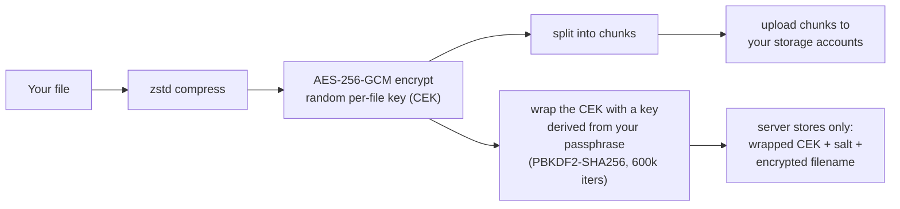
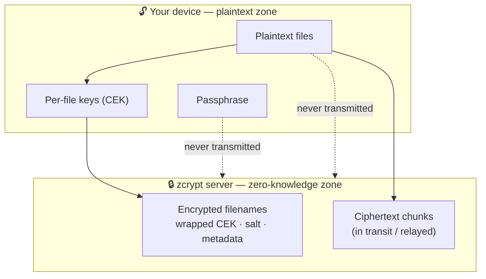
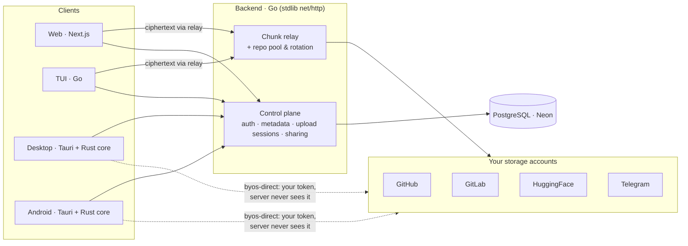

<div align="center">

# Zcrypt.cloud

**Zero-knowledge, end-to-end encrypted cloud storage that lives inside _your own_ GitHub, GitLab, HuggingFace, and Telegram accounts.**

Your files are compressed, encrypted, and split into chunks _on your device_ before they ever move. The server never sees your passphrase. The storage platforms never see your plaintext. zcrypt is free and open source — there are no paid tiers.

[Report a vulnerability](docs/SECURITY.md) · [Contributing](CONTRIBUTING.md) · [Support](SUPPORT.md) · [Changelog](CHANGELOG.md)

</div>

---

## Table of contents

- [What zcrypt is](#what-zcrypt-is)
- [How it works](#how-it-works)
- [Architecture](#architecture)
- [Clients](#clients)
- [Features](#features)
- [Security](#security)
- [Tech stack](#tech-stack)
- [Quick start](#quick-start)
- [Environment variables](#environment-variables)
- [Project structure](#project-structure)
- [API overview](#api-overview)
- [Storage platforms](#storage-platforms)
- [Contributing](#contributing)
- [Support](#support)
- [Sponsor zcrypt](#sponsor-zcrypt)
- [License](#license)

---

## What zcrypt is

zcrypt turns storage you already have — GitHub, GitLab, HuggingFace, and Telegram — into a single encrypted drive. Files are compressed with zstd, encrypted with AES-256-GCM under a key that never leaves your device, split into chunks, and stored across those platforms behind disguised repositories and innocuous filenames.

Because encryption happens client-side, **zcrypt is zero-knowledge**: the server stores only ciphertext, encrypted filenames, a wrapped key, and a salt. It cannot read your files, recover your passphrase, or hand your plaintext to anyone — because it never has them.

## How it works

Every file goes through the same client-side pipeline before a single byte leaves your device:



**Download** reverses it: chunks are fetched and verified (per-chunk integrity), reassembled, decrypted with your passphrase, and decompressed — all locally.

### The zero-knowledge trust boundary

The line between what stays on your device and what the server can ever see is the whole point of the product:



## Architecture

zcrypt has **two data planes**, and which one you use depends on the client:



- **Relay plane (web + TUI):** browser sandboxing blocks direct platform access, so the web app encrypts locally and relays ciphertext through the backend, which commits it to the storage platforms.
- **BYOS-direct plane (desktop + Android):** the native clients hold your platform tokens in the OS keychain and push/pull encrypted chunks **straight to your own accounts**. The backend is used only for auth and metadata — it never touches your storage token or your chunks.

Both planes share one **Rust core** (`app/core`, crate `zcrypt-core`) that implements the crypto, compression, chunk pipeline, offline ledger, and platform adapters. Its byte-format is locked to the Go backend and the TypeScript web client by a shared conformance test suite, so a file encrypted by one client decrypts identically on another.

## Clients

| Client | Status | Notes |
| ------ | ------ | ----- |
| **Web** (Next.js 16) | Production | The flagship. Deployed on Vercel. Client-side crypto via WebCrypto + WASM zstd. Uses the relay plane. |
| **Desktop** (Tauri v2) | Shippable · unsigned | macOS / Windows / Linux. Embeds the Rust core in-process. BYOS-direct, OS-keychain credentials, Touch ID unlock, folder-watch auto-backup, background sync, launch-at-login, built-in updater. Installers are currently unsigned. |
| **Android** (Tauri mobile) | Beta | A real native APK on the same Rust core (not a webview wrapper). Distributed as a sideload from the rolling [`android-latest`](https://github.com/Wosmos/zcrypt/releases) prerelease. Signed with an ephemeral CI key today, so it is not Play-Store-eligible and updates do not install over a prior sideload. |
| **TUI** (Go · Bubble Tea) | Shippable | Cross-platform static binaries via GoReleaser, also published to npm as `@zcrypt/cli`. Talks to the backend HTTP API. |

iOS compiles but is not yet built in CI — it is in development.

## Features

**Encryption & privacy**
- Zero-knowledge, client-side AES-256-GCM encryption — your passphrase never leaves your device
- Envelope encryption: a random per-file key (CEK) wrapped by a passphrase-derived KEK (PBKDF2-SHA256, 600,000 iterations)
- Encrypted filenames and keyed content hashing (HMAC) to resist confirmation-of-file attacks
- Decoy / duress profile — a separate password opens a plausible decoy vault under coercion

**Storage**
- Multi-platform backends: GitHub, GitLab, HuggingFace, and Telegram
- Bring-your-own-storage (BYOS-direct) on desktop/mobile — chunks go straight to your own accounts
- Repository disguise — repos, commit messages, and filenames look like ordinary developer projects
- Automatic repo rotation as size thresholds are hit (most useful on GitHub/GitLab; see [Storage platforms](#storage-platforms))
- Resumable, chunked uploads that survive restarts; concurrent chunk transfer with live progress over SSE

**Files & collaboration**
- Folders, optionally protected with a per-folder password
- Sharing: password-protected file & folder links, and ephemeral **Send** links (expiry + burn-after-read)
- **Spaces** — multi-member shared vaults with per-member X25519 key wrapping and key rotation
- **Timed Vaults** — self-destructing vaults that expire on a schedule
- **Text Pad** — encrypted, expiring / burn-after-read paste
- **Device Transfer** — direct device-to-device transfer over a WebSocket relay with code/QR pairing
- **Sync & Offline** — folder sync, offline pinning, and encrypted clipboard sync across your devices
- Trash with restore and permanent purge; point-in-time snapshots and on-demand integrity checks
- Per-file / per-folder custom styling, file re-key (re-wrap into a Space), and bulk operations

**Accounts & admin**
- Email + password auth, OAuth (Google / GitHub), and passwordless magic-link login
- TOTP 2FA (RFC-6238) with one-time-use codes and backup recovery codes
- Per-user storage quotas (zcrypt is free — there are no paid tiers; quotas are an admin control, not a paywall)
- Admin panel: user management, quotas, system stats, storage reconcile, and a tamper-evident, hash-chained audit log
- Per-user analytics / "Insights"

## Security

> Full policy and private disclosure process: **[docs/SECURITY.md](docs/SECURITY.md)**. Please do not open a public issue for suspected vulnerabilities.

### Encryption design
- **File encryption:** AES-256-GCM. A fresh random CEK per file; a 12-byte IV and 16-byte tag per chunk. (Batch uploads share one passphrase-derived salt/KEK for the batch, but every file still gets its own random CEK and unique nonces.)
- **Key derivation:** PBKDF2-SHA256, 600,000 iterations (OWASP-recommended), identical on the web, Go, and Rust implementations and pinned by shared test vectors.
- **Platform tokens & TOTP secrets at rest:** AES-256-GCM sealed under a per-user KEK derived from `MASTER_KEY` via HKDF-SHA256.
- **Passwords:** bcrypt (cost 12).
- **Passphrase:** never stored, never logged, never sent to the server or the storage platforms.

### Auth hardening
- HS256 JWTs with strict algorithm validation (rejects `alg: none` / algorithm-confusion) and a separate short-lived token type for the 2FA step, so a password-only attacker can't skip 2FA.
- One-time-use TOTP codes (replay-rejected) and hashed backup codes.
- Login rate limiting per IP **and** per email; timing-equalized password checks and generic errors to resist user enumeration.

### Server hardening
- CORS allow-list (no wildcard); 1 MB JSON body cap; path-traversal and header-injection protection on filenames.
- Global and per-endpoint rate limiting (in-memory, per instance).
- Security headers: HSTS, `X-Frame-Options`, `X-Content-Type-Options: nosniff`, `Referrer-Policy`, `Permissions-Policy`, and a Content-Security-Policy on the frontend. **Note:** the CSP ships **report-only** by default — set `CSP_ENFORCE=1` to enforce it.
- Errors are logged server-side only; clients receive sanitized messages.

### What the server cannot do
- Read your files (encrypted with a passphrase it never receives)
- Recover your passphrase (PBKDF2 is one-way)
- Access your storage without your token (tokens are sealed at rest; on desktop/mobile they never leave your device)

## Tech stack

| Layer | Technology |
| ----- | ---------- |
| Web frontend | Next.js 16, React 19, TypeScript, Tailwind CSS, Zustand 5, Motion 12 |
| Client core | Rust (`zcrypt-core`) — crypto, zstd, chunk pipeline, SQLite ledger, platform adapters |
| Desktop / mobile | Tauri v2 (Rust core embedded in-process) |
| TUI | Go 1.25, Bubble Tea |
| Backend | Go 1.25, stdlib `net/http` (no framework), pgxpool |
| Database | PostgreSQL on Neon (serverless) |
| Encryption | AES-256-GCM, PBKDF2-SHA256 (600k), HKDF-SHA256, X25519 (sharing), bcrypt, TOTP |
| Compression | zstd (WebCrypto/WASM in the browser; native in the Rust core) |
| Deploy | Web on Vercel, backend on Railway (distroless Docker), DB on Neon |

## Quick start

### Prerequisites
- Go 1.25+
- Node.js 20+ and [Bun](https://bun.sh)
- PostgreSQL (or a free [Neon](https://neon.tech) database)
- Rust (stable) — only needed to build the desktop/mobile clients
- Docker (optional)

### Backend

```bash
cd app/backend

# Copy the template and fill in your OWN values. .env is gitignored — never commit real secrets.
cp .env.example .env
# At minimum set DATABASE_URL, MASTER_KEY, and ZCRYPT_JWT_SECRET.

# Generate a 32-byte key for MASTER_KEY / ZCRYPT_JWT_SECRET:
openssl rand -hex 32

go build -o zcrypt-server . && ./zcrypt-server
```

### Frontend

```bash
cd app/frontend
bun install
echo "NEXT_PUBLIC_API_URL=http://localhost:8080" > .env.local
bun run dev        # dev server
bun run build      # production build
```

### Desktop (Tauri + Rust core)

```bash
cd app/desktop
bun install
bun run tauri dev      # run the desktop app against your local/remote backend
bun run tauri build    # produce an installer for the current OS
```

### TUI

```bash
cd app/tui
go build ./... && ./zcrypt-tui
```

### Docker (backend)

```bash
docker build -t zcrypt .
docker run -p 8080:8080 \
  -e DATABASE_URL="postgresql://..." \
  -e MASTER_KEY="$(openssl rand -hex 32)" \
  -e ZCRYPT_JWT_SECRET="$(openssl rand -hex 32)" \
  -e FRONTEND_URL="https://your-frontend.example" \
  -e BACKEND_URL="https://your-backend.example" \
  zcrypt
```

## Environment variables

The backend is configured entirely through environment variables. A documented template lives at [`app/backend/.env.example`](app/backend/.env.example) — copy it to `.env` and fill in your own values. `.env` is gitignored; never commit real secrets.

### Backend (required)

| Variable | Description |
| -------- | ----------- |
| `DATABASE_URL` | PostgreSQL connection string |
| `MASTER_KEY` | 32-byte hex key for envelope encryption of platform tokens & TOTP secrets |
| `ZCRYPT_JWT_SECRET` | JWT signing secret (≥32 chars). Set it explicitly — if empty it is auto-generated and will not persist across restarts on ephemeral hosts, logging everyone out. |
| `FRONTEND_URL` | Frontend URL — used for email links and the post-OAuth redirect; also added to the CORS allow-list |
| `BACKEND_URL` | Public backend URL, no trailing slash. **Required for OAuth** — it builds the `redirect_uri`, which must exactly match what is registered with Google/GitHub. If unset it is derived per request and usually breaks OAuth. |
| `ALLOWED_ORIGINS` | Comma-separated CORS allow-list (defaults to localhost; `FRONTEND_URL` and the Tauri desktop origins are added automatically) |

### OAuth (optional — Google / GitHub login)

Enabled per provider only when both the client ID **and** secret are set.

| Variable | Description |
| -------- | ----------- |
| `GOOGLE_CLIENT_ID` / `GOOGLE_CLIENT_SECRET` | Google OAuth credentials |
| `GITHUB_CLIENT_ID` / `GITHUB_CLIENT_SECRET` | GitHub OAuth app credentials |

Register these **exact** redirect URIs (substitute your real `BACKEND_URL`):
- Google → `https://<BACKEND_URL>/api/auth/oauth/google/callback`
- GitHub → `https://<BACKEND_URL>/api/auth/oauth/github/callback`

The backend logs the exact URIs at startup and serves them (no secrets) at `GET /api/auth/oauth/config`.

### Backend (optional)

| Variable | Description |
| -------- | ----------- |
| `ZCRYPT_PORT` | Server port (default 8080; some hosts inject `PORT`) |
| `RESEND_API_KEY` / `RESEND_FROM` | [Resend](https://resend.com) credentials — enables verification / reset emails |
| `CSP_ENFORCE` | `1` enforces the frontend Content-Security-Policy (report-only otherwise) |
| `DEV_MODE` | `true` disables ALL rate limiting — local load testing only, never in production |

### Frontend

| Variable | Description |
| -------- | ----------- |
| `NEXT_PUBLIC_API_URL` | Backend API URL |

## Project structure

```
app/
  backend/          Go backend — module github.com/zcrypt/zcrypt
    cmd/            HTTP handlers (auth, upload sessions, files, folders, shares,
                    spaces, send, pad, transfer, sync, deadman, decoy, keys, admin, events)
    pipeline/       Server-side upload progress (SSE pub/sub)
    crypto/         Token/TOTP envelope encryption (HKDF per-user KEK), sealed boxes
    chunks/         Splitting, merging, SHA-256 verification
    adapters/       Storage adapters: GitHub, GitLab, HuggingFace, Telegram
    reppool/        Repository pool + auto-rotation
    index/          PostgreSQL layer (pgxpool, raw SQL, migrations)
    auth/           JWT, bcrypt, TOTP, backup codes, email
    disguise/       Fake repo names, commit messages, filenames

  core/             Rust client engine — crate zcrypt-core (embedded by desktop & Android)
    src/crypto      AES-256-GCM, PBKDF2, key wrap/unwrap, content HMAC
    src/engines     Upload / streaming download / bulk-zip / background sync / delete
    src/adapters    BYOS-direct platform adapters (github/gitlab/huggingface/telegram)
    src/localdb     Offline-first SQLite ledger
    src/api         Backend control-plane HTTP client (token refresh, retry)
    tests/          Cross-implementation conformance vectors

  frontend/         Next.js 16 / React 19 web app
    app/(app)/      Authenticated pages (dashboard, spaces, settings, analytics, admin)
    app/(auth)/     Auth pages (login, register, 2FA, magic-link, OAuth callback)
    app/(marketing)/ Landing, docs, comparisons, privacy, terms
    components/ store/ hooks/ lib/ types/

  desktop/          Tauri v2 shell (macOS / Windows / Linux + Android build) — embeds core
  tui/              Go Bubble Tea terminal client — module github.com/zcrypt/zcrypt-tui
```

## API overview

The backend speaks JSON over `net/http`, authenticated with `Authorization: Bearer <jwt>`, plus SSE for realtime. The tables below are a representative subset — the authoritative route list is `RegisterRoutes` in [`app/backend/cmd/server.go`](app/backend/cmd/server.go).

### Auth
| Method | Endpoint | Description |
| ------ | -------- | ----------- |
| POST | `/api/auth/register` · `/login` · `/logout` · `/refresh` | Account & session |
| POST | `/api/auth/magic-link` · `/magic-link/verify` | Passwordless login |
| GET | `/api/auth/oauth/{provider}` · `/callback` · `/desktop-poll` | OAuth (Google/GitHub) |
| POST | `/api/auth/2fa/setup` · `/enable` · `/verify` · `/disable` · `/backup-codes` | TOTP 2FA |
| POST | `/api/auth/forgot-password` · `/reset-password` · `/verify-email` | Recovery |
| GET | `/api/auth/me` | Current user |

### Upload (resumable session, one chunk per request)
| Method | Endpoint | Description |
| ------ | -------- | ----------- |
| POST | `/api/upload/init` | Start a session |
| PUT | `/api/upload/{sid}/chunk/{idx}` | Relay-upload an encrypted chunk |
| POST | `/api/upload/{sid}/presign/{idx}` · `/confirm/{idx}` | BYOS-direct chunk (presigned) |
| POST | `/api/upload/{sid}/complete` | Finalize |
| GET | `/api/upload/{sid}/status` · `/api/upload/incomplete` | Resume support |

### Files, storage & realtime
| Method | Endpoint | Description |
| ------ | -------- | ----------- |
| GET | `/api/files` · `/files/trash` · `/files/{id}/meta` | Listing & metadata |
| GET | `/api/files/{id}/chunks/{idx}` · `/files/{id}/locators` | Relay / BYOS-direct download |
| DELETE | `/api/files/{id}` · `/files/{id}/purge` | Trash / permanent delete |
| POST | `/api/repos/register` · `/repos/{id}/deactivate` | Client-registered BYOS repos |
| GET | `/api/changes?since=` · `/api/events` | Change feed & SSE progress |
| GET | `/api/transfer/ws` | Device-to-device WebSocket transfer |

Sharing (`/api/shares`, `/api/folder-shares`, `/api/send`), Spaces (`/api/shared-vaults`), Timed Vaults (`/api/vaults`), Pad (`/api/pad`), keys (`/api/keys`), quota, snapshots/integrity, and admin (`/api/admin/*`, including `/audit` + `/audit/verify`) round out the surface.

## Storage platforms

Each platform stores chunks differently — zcrypt hides that behind one adapter interface:

| Platform | How chunks are stored | Rotation threshold | Notes |
| -------- | --------------------- | ------------------ | ----- |
| **GitHub** | Base64 file commits via the Contents API (one commit per chunk) — **not** Git LFS | ~850 MB / repo | Rotation to a fresh disguised repo adds real capacity |
| **GitLab** | Base64 files via the Repository Files REST API | ~9 GB / repo | Rotation adds real capacity |
| **HuggingFace** | Git LFS batch protocol (presigned blob upload + commit) | ~90 GB | Safety threshold under HF's **100 GB per-account** cap — rotating repos does **not** add capacity |
| **Telegram** | Bot API `sendDocument` (chunks >19 MB auto-split around the 20 MB limit) | virtual (~50 GB) | No real repos; effectively the unlimited backend |

Repo rotation (`app/backend/reppool`) deactivates a repo once it crosses its threshold and creates a fresh disguised replacement. HuggingFace batches deletes into a single commit to stay under its ~128 commits/hour/repo limit.

## Contributing

Contributions are welcome — see [CONTRIBUTING.md](CONTRIBUTING.md) for local setup, coding conventions, the module quality gates, and the branch/PR workflow. By contributing you agree your work is licensed under the project's [MIT License](LICENSE).

For anything that might be a security vulnerability, follow the private disclosure process in [docs/SECURITY.md](docs/SECURITY.md) instead of opening a public issue.

## Support

Need help, found a bug, or want to request a feature? See **[SUPPORT.md](SUPPORT.md)** for where to go and what to expect.

## Sponsor zcrypt

zcrypt is free, open source, and has no paid tiers — the core will always be free. But it costs real money to run: database, hosting, and egress bandwidth. Donations go to exactly that — keeping the infrastructure (and the free tier) alive. No investors, no ads, nothing sold about you.

If zcrypt is useful to you and you can spare it, sponsorship genuinely helps:

- **GitHub Sponsors:** [github.com/sponsors/Wosmos](https://github.com/sponsors/Wosmos)

<!-- SPONSOR-CHANNELS: additional channels (Ko-fi, crypto) are added here once configured. -->

Every bit is appreciated, and none of it is required.

## License

zcrypt is open source under the [MIT License](LICENSE) © 2026 Muhammad Wasif Malik.
