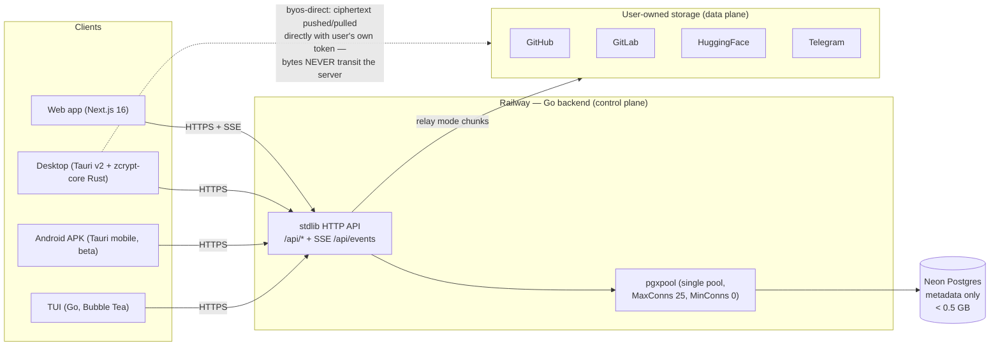
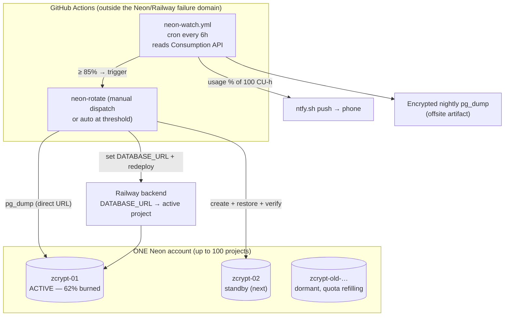
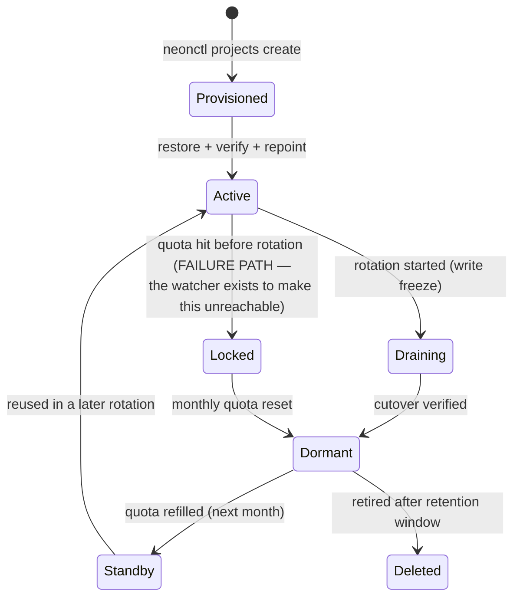
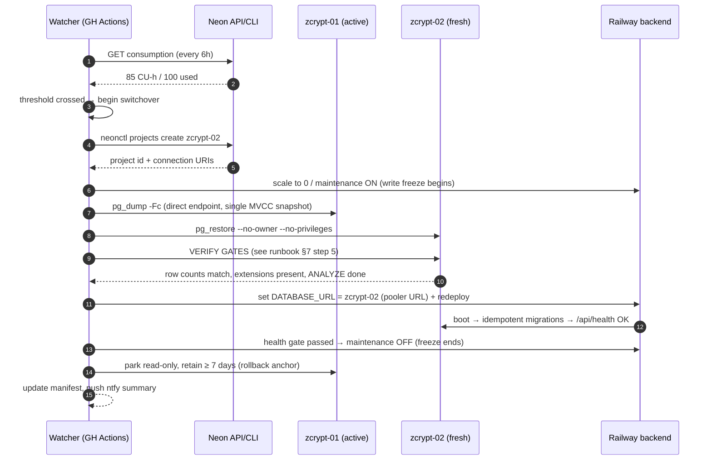
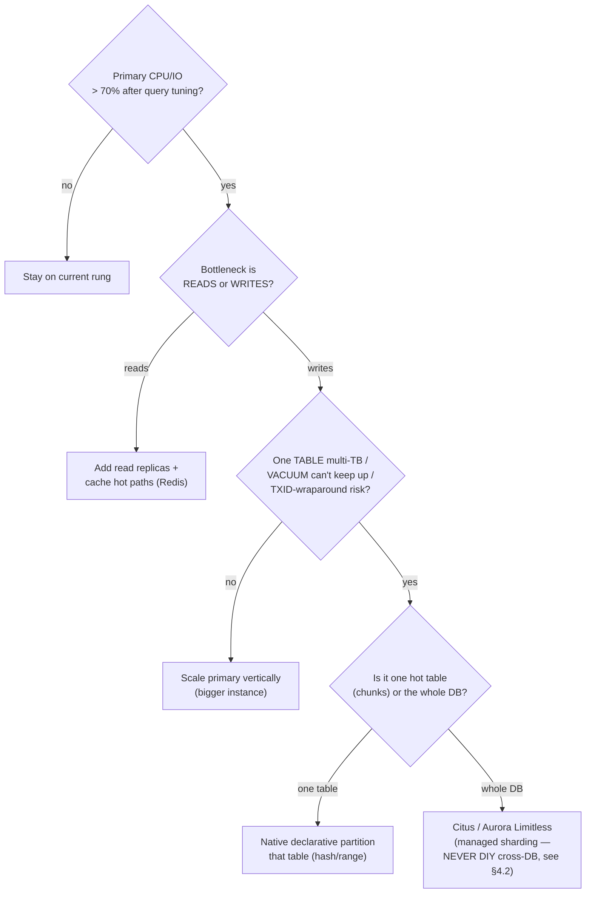

# zcrypt — From One Database to One Hundred: The Neon Rotation Plan

> **Status:** Draft for review — written 2026-07-20 during the quota-lockout incident.
> **Decision:** Rotation carousel (Plan D) for the free-tier era. Per-user sharding
> rejected with evidence (§4.2). The path to 1M users is §14 — and it is *not* sharding.
> **Owner:** solo-dev. **Applies to:** `app/backend` (control plane), Neon, Railway.

---

## 1. Why this document exists

On 2026-07-20 the production Neon project hard-locked:

```
ERROR: Your account or project has exceeded the compute time quota.
Upgrade your plan to increase limits.
```

Every path to the data — the app, `psql`, `pg_dump` — goes through the same suspended
compute endpoint, so the lockout also locked out our own **backup path**. No
notification preceded it (Neon free tier has no proactive usage alerts; suspension is
silent). Quota resets in ~10 days from the incident.

**Root cause of the burn (found + fixed, pending deploy):** two frontend SSE consumers
(`useFileEvents.ts`, `devices-tab.tsx`) registered no `onerror` handler, so any flaky
connection fell back to the browser's native `EventSource` retry — a fixed ~3 s loop,
uncapped, per open tab. `useFileEvents` additionally fired `invalidateFilesViews()`
(three DB-backed refetches: files, trash, quota) on every reconnect, and it is mounted
globally for every authenticated session. Continuous query traffic ⇒ Neon's compute
never reached its 5-minute autosuspend ⇒ the compute billed ~24/7 until the 100
CU-hour allowance was gone.

The goal of this plan: **make the free tier's real allowance — up to 100 projects ×
100 CU-hours/month, per account — durably usable**, so a bug or a growth spike never
again silently takes the product offline, and so the escape from a locked project is a
runbook, not an emergency.

Facts this plan is built on (verified against Neon's pricing page + docs, 2026-07):

| Neon free tier fact | Value |
|---|---|
| Projects per account | **100** |
| Compute allowance | **100 CU-hours / project / month** (per-project, independent — confirmed in docs FAQ) |
| Storage | 0.5 GB / project |
| Egress | 5 GB / project / month |
| Autosuspend ("scale to zero") | after 5 min idle |
| On quota exhaustion | **hard compute suspension** until the next billing month — no dump possible |
| Advance warning | **none** (dashboard graph only) |
| Multiple accounts | **prohibited** by Acceptable Use Policy (account block risk) — many projects on *one* account is the supported model |

---

## 2. Current system topology (what actually talks to Postgres)

The 2026 stack is no longer web-only. It matters here because it determines the blast
radius of a database cutover: **exactly one component holds a Postgres connection.**



Key properties:

- **The Rust core (`app/core`, zcrypt-core)** runs in-process in the desktop/Android
  shell: streaming upload engine, bulk ZIP download, byos-direct push/pull, CEK cache,
  key zeroization. It authenticates to the **backend API** — it never opens a SQL
  connection.
- **byos-direct** (desktop/Android) moves ciphertext client → user's own platform
  directly; the backend only records metadata (repo registration, chunk confirms,
  locators, the cross-device change feed). Postgres is a pure **control-plane store**.
- File bytes live on git platforms/Telegram. Postgres holds **metadata only** — users,
  files, chunks (rows, not bytes), folders, shares, spaces, tokens (encrypted), audit
  chain. This is why the whole database fits comfortably under Neon's 0.5 GB cap and
  why `pg_dump` of the entire OLTP schema is a minutes-scale operation.
- Therefore: **a database cutover = changing one `DATABASE_URL` env var on one Railway
  service.** No client ships a connection string; no client update is ever needed.

---

## 3. What "1 DB → 100 DBs" can mean — the two mental models

| | Model A: **Concurrent sharding** | Model B: **Sequential rotation (carousel)** |
|---|---|---|
| Shape | Users **partitioned** across N live projects, all serving at once | Whole DB on **one active** project; fresh project swapped in when the active one nears quota |
| What multiplies | Concurrent compute throughput | **Runway over time** (each fresh project = fresh 100 CU-h; burned projects refill monthly and re-enter the pool) |
| Query routing | `user_id → shard` router inside the backend | None — one `DATABASE_URL` |
| Cross-user features | Break (see §4.2) | Untouched |
| Code changes | ~250 call-site rewrite + directory shard + feature redesign | **Zero** |
| Fits the failure we had | ✗ (active users would all sit on shard 1 anyway — sequential fill does not spread compute) | ✓ (the failure is "one project's monthly quota exhausted" — the fix is "next project") |

zcrypt's incident is a **quota-exhaustion-over-time** problem, not a throughput
problem. A 0.25 CU compute serving a solo-dev user base does not need horizontal
scale-out; it needs **quota failover**. That is Model B.

---

## 4. Options considered — pros, cons, verdicts

### 4.1 Plan A — Stay single-project, fix the leak, hope

**Pros:** zero work beyond the leak fix; simplest possible operations.
**Cons:** no escape hatch when (not if) something burns quota again — a new bug, a
traffic spike, a crawler. And the trap is asymmetric: by the time you notice, the
dump path is already locked. **RPO at lockout = the age of your last manual dump; RTO
= days-to-weeks (quota reset).** That is what we are living right now.
**Verdict: insufficient alone.** Its ingredients (leak fix, monitoring) are absorbed
into Plan D.

### 4.2 Plan B — Per-user sharding across projects (REJECTED, with evidence)

The tempting reading of "100 projects": hash `user_id` → one of N projects, get
N × 100 CU-hours *concurrently*. A full read-only audit of the codebase (2026-07-20,
three parallel auditors over `index/`, `cmd/`, `schema.go`) says no. The plumbing is
ideal — every query funnels through **one** `*index.DB` struct wrapping **one**
`pgxpool.Pool`, `pgxpool` is imported in exactly one file, handlers never touch SQL —
but the **data model** is not shardable by user:

**Fatal blockers** (feature physically cannot work across per-user shards):

1. **Spaces / shared vaults** — the defining multi-tenant feature.
   `MemberSpaceFileGrant` (`index/shared_vault_queries.go:341`) JOINs member A's
   membership row to owner B's `files` row and returns B's `user_id`; the download
   path then reads **B's** `chunks` and decrypts with **B's** `platform_tokens`.
   With A on shard 3 and B on shard 7, shard 3 *does not contain* B's rows, and
   PostgreSQL has no cross-database join (no federated query engine; `postgres_fdw`
   is not available/sane on Neon free). The feature dies or requires replicating
   owner metadata into every member's shard — a consistency nightmare (multi-master
   anomalies, no distributed transaction coordinator).
2. **Anonymous Send + Pads** — `send_transfers`, `send_chunks`, `pads`
   (`index/schema.go`) have **no `user_id` column at all** (keyed by IP + global
   token). There is no shard key. These tables *must* live in a global database.

**Major blockers** (each forces a "directory shard" back into the design):

3. **Global platform tokens** — the managed-pool credential is read on **every**
   upload/download via `WHERE user_id = $1 OR is_global = TRUE`
   (`index/token_queries.go:26`). A hot-path read that must reach a shard the user
   doesn't own ⇒ every request touches the global shard anyway ⇒ the bottleneck
   sharding was meant to remove is reintroduced at the center.
4. **Public share/folder-share/send token resolution** — `WHERE token = $1` with no
   user context (`index/queries.go:1418` et al.). The URL does not encode a shard ⇒
   needs a global `token → shard` routing table (a distributed secondary index)
   or scatter-gather across 100 databases per anonymous click.
5. **Admin aggregates** — `GetSystemStats` does `COUNT(*)`/`SUM()` over all users in
   single queries (`index/auth_queries.go:287`) ⇒ scatter-gather + application-side
   aggregation, or maintained rollups.
6. **Tamper-evident audit chain** — one global monotonic `seq` + `prev_hash` chain
   serialized by a `pg_advisory_xact_lock` across **all** users
   (`index/audit_queries.go:61`). Per-user shards shatter the chain's integrity
   guarantee (the whole point of a hash chain is one total order).
7. **Invite-by-email** — `ResolveUserPublicKey` looks up an arbitrary user by
   email/username (`index/key_queries.go:48`) ⇒ needs a global user directory.

**What sharding would actually cost:** rewrite ~235 pool call sites + 16
transactions; stand up and operate a 101st "directory" database; re-solve Spaces
(replication or forced co-location); convert three background workers from
single-query sweeps to 100-way fan-outs; run schema migrations against 100+ databases
per deploy with partial-failure handling; accept that cross-user writes (creating a
share) can no longer be a single ACID transaction — you inherit sagas/2PC-lite for a
storage product's *sharing* path.

One genuinely useful audit correction: **the repo pool is per-user**
(`repos.user_id NOT NULL`, `reppool.Manager` instantiated per user), so `chunks →
repos` co-shards cleanly. It isn't a blocker — the seven items above are.

| Pros | Cons |
|---|---|
| N × 100 CU-h *concurrently* | Kills Spaces + Send/Pads as built (fatal) |
| Clean single-pool chokepoint makes the mechanical part tractable | Directory shard re-centralizes the hot path (global token read on every transfer) |
| | Weeks of work + permanent complexity tax on every future feature |
| | 100-DB migrations, debugging, monitoring surface |
| | Loss of single-database ACID for cross-user writes |

**Verdict: rejected.** Not "hard" — *wrong for this data model*.

### 4.3 Plan C — Functional partitioning (tables split across projects)

Move self-contained table islands (e.g. `send_transfers`/`send_chunks`/`pads`, or
`audit_events`) to a second project to spread compute burn.

**Pros:** no user routing; islands are join-free.
**Cons:** compute burn isn't caused by those islands (they're cold); every partition
adds a connection pool, a migration target, and a monitoring surface; the hot tables
(files/chunks/tokens) join constantly and cannot be separated. Saves ~nothing, costs
real complexity.
**Verdict: rejected** — optimizes the cold path.

### 4.4 Plan D — **Rotation carousel (CHOSEN)**

One active project at a time. Preemptive **switchover** (planned cutover — this is
deliberately *not* a failover, which is what we're living through now) to a freshly
provisioned project at ~85% quota burn. Retired projects keep their data, refill
their quota at the monthly reset, and re-enter the pool.

**Pros:**
- Every feature works unchanged — one logical database preserves all joins, FKs,
  transactions, the audit chain's total order, and single-writer semantics.
- Zero backend code changes (the single-`DATABASE_URL` chokepoint *is* the design).
- Multiplies runway sequentially: theoretical ceiling 10,000 CU-h/month/account;
  realistically 1–3 projects cycled per month even under a bad leak.
- Clients never notice: no client holds a connection string (§2).
- The runbook doubles as disaster recovery for *any* Neon-side failure.

**Cons / accepted trade-offs:**
- A rotation has a small planned **write-freeze window** (minutes; §6).
- Requires disciplined monitoring — the entire failure we just had was "no watcher."
- Bounded by the 0.5 GB/project storage cap (metadata-only DB: fine; §8 tracks it).
- Single-account blast radius: all projects live under one Neon account (§8, V-9).

### 4.5 Plan E — Paid tier

Noted for completeness: Launch is pay-as-you-go (~$0.106/CU-h, no minimum, spending
caps). Out of scope by owner decision; the carousel does not preclude it later.

---

## 5. The carousel — architecture



**Why the watcher lives on GitHub Actions:** monitoring must not share a failure
domain with what it watches. A watcher on Railway goes blind in a Railway outage; a
watcher needing the Postgres data plane goes blind in exactly the quota-suspension it
exists to predict. Neon's **management API is control-plane** — it keeps answering
while the compute is suspended (the one door that stayed open during this incident).

**The exact usage read (free-plan-correct):** the dedicated
`consumption_history` endpoints are **paid-plan-only** (403 on Free — legacy needs
Scale+, v2 needs Launch+). On the free plan, current-period usage lives directly on
the project object:

```
GET https://console.neon.tech/api/v2/projects/{project_id}
Authorization: Bearer $NEON_API_KEY
→ .project.compute_time_seconds        # CU-seconds this billing period (÷3600 = CU-h)
  .project.consumption_period_start/_end
  .project.data_storage_bytes_hour, .data_transfer_bytes   (storage/egress watch)
```

Management-API rate limit: 700 req/min/account ([docs](https://api-docs.neon.tech/reference/api-rate-limiting))
— a 6-hourly watcher uses ~0.001% of it.

### Project lifecycle (state machine)



The **`Active → Locked` edge is the incident we just had.** Every control in this
document exists to make that edge unreachable: the watcher alerts at 60%/80%, rotation
triggers at 85%, and the sacred rule is **never let the only copy of the data sit
behind a quota you're about to exhaust.**

---

## 6. Cutover mechanics — DBMS analysis

### 6.1 Chosen mechanism: logical backup/restore (`pg_dump`/`pg_restore`)

For a metadata-only OLTP database well under 0.5 GB, a **logical backup** cutover is
the right tool:

- `pg_dump` runs inside a **single repeatable-read transaction** on one MVCC
  snapshot — the dump is **transactionally consistent** across all tables (every FK
  edge intact) with no table locks beyond `ACCESS SHARE`.
- Restore into an empty project takes minutes at this size; `--no-owner
  --no-privileges` sidesteps role mismatches between Neon projects.
- Full-database `pg_dump` emits `setval()` for every sequence, so **sequence
  desynchronization** (the classic partial-restore bug: `BIGSERIAL` counters
  restarting and colliding with restored rows) does not occur on a *full* restore.
  zcrypt is UUID-PK (`gen_random_uuid()`) almost everywhere; the integer-keyed
  exceptions (`pending_deletions.id`, `audit_events.seq`) ride along correctly.
- **Extensions are catalog objects, not dump content:** `pg_trgm` must exist on the
  target. zcrypt already self-heals — `applyOptionalExtensions` re-runs `CREATE
  EXTENSION IF NOT EXISTS pg_trgm` at boot and degrades to sequential scans if it
  can't (`index/db.go:69`). Migrations are likewise idempotent (`CREATE TABLE IF NOT
  EXISTS`), so the post-restore boot is safe by construction.
- Always dump over the **direct (non-pooler) endpoint**: PgBouncer-style transaction
  pooling multiplexes sessions and can break `pg_dump`'s session-pinned snapshot.

**Write-freeze requirement (the split-brain guard):** between the moment `pg_dump`'s
snapshot is taken and the moment Railway is repointed, any write to the old project
is **silently lost** (a dual-write / lost-update anomaly — two divergent copies, no
conflict detection, no merge). For a solo-operated product the honest mitigation is a
short **maintenance window**: scale the Railway service down (or flip a maintenance
flag), take the dump, restore, verify, repoint, redeploy. Total downtime ≈ single-digit
minutes. RPO = 0 (snapshot taken after writes stop). RTO = the window itself.

### 6.2 Considered upgrade: logical replication cutover (near-zero downtime)

Publisher on the old project → subscription on the new → wait for replication lag ≈ 0
→ freeze writes seconds, not minutes → flip. This is the textbook minimal-downtime
switchover (publication/subscription, WAL-decoded row streaming via a replication
slot). **Confirmed viable: Neon supports logical replication on ALL plans, as both
publisher and subscriber** ([guide](https://neon.com/docs/guides/logical-replication-guide),
[Neon-to-Neon](https://neon.com/docs/guides/logical-replication-neon-to-neon)). Two
hard caveats from the docs:

- Enabling it flips `wal_level = logical` **project-wide and irreversibly**.
- **An active subscriber pins the publisher's compute awake** (blocks scale-to-zero)
  — i.e. the replication window itself burns the very quota we're escaping, and
  sequences are never replicated (manual `setval` at cutover). Use it as a brief
  cutover tool, never a standing pipe.

For a sub-0.5 GB database the practical win is small (minutes → seconds); adopt only
if rotation frequency ever makes the maintenance window annoying.

### 6.2b Native alternative: Neon Import Data Assistant

Neon ships a console tool that migrates a database into a **new project** from just a
connection string — explicitly supported Neon→Neon
([docs](https://neon.com/docs/import/import-data-assistant)). Limits: < 10 GB, 1-hour
cap, **source is read-only during import** (a built-in write freeze). For a manual,
click-driven rotation this is the lowest-effort path and worth using for the *first*
rotation; the scripted `pg_dump` runbook remains the automatable + provider-portable
one. Note it needs a live source compute — like every option, **it cannot rescue an
already-locked project**.

### 6.3 Rotation sequence



---

## 7. The rotation runbook (`scripts/neon-rotate.sh` — to be built)

Pre-flight (abort on any failure):
1. **Confirm the old project is still dumpable** — `SELECT 1` over the direct URL.
   (If it's already locked, this runbook is void; see §9 recovery path.)
2. **Manifest check** — read the carousel manifest (active project id, standby id,
   last-rotation timestamp) so a crashed prior rotation can't double-run.
3. **Fresh offsite backup exists** — a same-day encrypted dump artifact.

Execute:
4. Create/reuse target (all verified against Neon docs + live OpenAPI spec):

   ```bash
   # create — the 201/CLI response includes connection_uris incl. pooler_host
   neon projects create --name zcrypt-NN --region-id aws-us-east-1 --output json
   # or fetch strings for an existing/standby project:
   neon connection-string --project-id <id>            # direct (for pg_dump)
   neon connection-string --project-id <id> --pooled   # pooled (for the app)
   # API equivalents: POST /api/v2/projects ; GET /projects/{id}/connection_uri?pooled=true
   ```
5. Freeze → dump → restore → **verify gates**, all mechanical:
   - per-table row counts: old vs new (`SELECT relname, n_live_tup` cross-checked
     with `COUNT(*)` on the big four: `users`, `files`, `chunks`, `folders`);
   - sequence currvals ≥ max(id) for integer-keyed tables;
   - `pg_trgm` present (or accept degraded search — boot self-heals);
   - `ANALYZE` on the new database (a restored DB has **no planner statistics**;
     skipping this is the classic "restore succeeded, everything is a seq-scan"
     performance trap);
   - `schema_migrations` content identical.
6. Repoint: Railway `DATABASE_URL` → new pooled URI; redeploy; **health gate** =
   `/api/health` 200 AND one authenticated read (list-files for a canary account)
   returns non-empty.
7. Post: park old project (rename `zcrypt-old-NN`, keep ≥ 7 days as the rollback
   anchor — rollback = repoint the env var back, accepting loss of writes made after
   cutover); update manifest; ntfy a one-line report.

Rollback rule: **any gate failure → repoint back to the old project** (it is still
consistent — the freeze guaranteed no divergence), delete the bad restore, alert,
stop. Never debug forward on the new primary with users live.

---

## 8. Failure-mode & vulnerability register

RPO = worst-case data loss; RTO = worst-case time-to-recovery. "Carousel" column =
how this plan handles it.

| # | Failure / vulnerability | DBMS mechanism | Consequence if unhandled | Carousel mitigation | RPO / RTO |
|---|---|---|---|---|---|
| V-1 | **Quota lockout before dump** (this incident) | compute suspension blocks all sessions incl. `pg_dump` | total outage until monthly reset; backups impossible *after* the fact | preemptive rotation at 85%; watcher alerts at 60/80; nightly offsite dumps mean a lockout never strands the *only* copy | RPO ≤ 24 h (nightly dump) / RTO = restore-to-fresh-project ≈ 1 h |
| V-2 | **Split-brain / dual-write** — writes hit old DB after the snapshot | lost-update anomaly; two divergent copies, no conflict resolution | silent data loss (uploads recorded on a DB nobody reads) | hard write-freeze (service down) for the whole dump→repoint window; single-writer topology (one Railway service) makes the freeze airtight | 0 / window ≈ minutes |
| V-3 | **Mid-rotation crash** (script dies after restore, before repoint) | — | confusion about which DB is authoritative | manifest is updated **last**; old DB remains active until the health gate passes; rotation is idempotent-restartable (re-dump, re-restore) | 0 / re-run |
| V-4 | **Restore succeeds but is slow-broken** | restored DB has empty `pg_statistic`; planner chooses seq scans | app "works" but every query crawls; compute burn *rises* | mandatory `ANALYZE` gate in step 5 | — |
| V-5 | **Missing extension on target** | `pg_trgm` + GIN index are catalog objects needing `CREATE EXTENSION` | filename search degrades | boot-time `applyOptionalExtensions` self-heals; verify gate checks anyway | — |
| V-6 | **Sequence desync** (partial restores only) | `setval` not replayed ⇒ PK collisions on insert | inserts fail with unique-violation | full-database dumps only (never table-selective); gate checks currval ≥ max(id) | — |
| V-7 | **Storage creep past 0.5 GB** | `audit_events` hash chain grows monotonically; expired pads/sends | future restores refused by target project | watcher tracks DB size monthly; prune policy for `audit_events` beyond retention; 6-hourly cleanup already expires pads/sends | — |
| V-8 | **Egress cap on dump path** | 5 GB/project/month; each dump is egress | dumps start failing late in month | DB ≪ 0.5 GB ⇒ ~30 nightly dumps ≪ 5 GB; watcher counts dump bytes | — |
| V-9 | **Account-level blast radius** | all 100 projects under one account; one AUP action = everything | catastrophic, simultaneous loss of every copy inside Neon | **never** multi-account (that's the AUP trigger); nightly **encrypted offsite** dump (age/openssl → private GitHub artifact) means Neon holds zero exclusive copies | RPO ≤ 24 h / RTO ≈ 1 h to any Postgres |
| V-10 | **Watcher blind spot** (Actions outage, cron skew, API change) | — | silent drift back to V-1 | watcher is dead-man-switched: a daily "I ran" heartbeat ping; missing heartbeat = alert from ntfy silence | — |
| V-11 | **Secrets sprawl** | Neon API key + DB URLs in CI | credential leak = full data-plane access | GH Actions encrypted secrets only; never in repo/manifest; rotate key on incident; dumps encrypted before leaving the runner | — |
| V-12 | **Neon changes free-tier terms** | policy risk, not technical | carousel economics shift under us | design is provider-portable: runbook targets vanilla Postgres — same script restores to Oracle-VM Postgres or any other host | — |
| V-13 | **Compute-hygiene regression** (a new polling loop ships) | any sub-5-min query cadence defeats autosuspend | slow quota burn returns | §10 checklist enforced in review; watcher's weekly burn-rate trend alert (burn > 2×baseline = investigate) | — |

---

## 9. Day-0 plan (the moment the current lock lifts)

Ordered; do not reorder — the ordering is the lesson of this incident:

1. **`pg_dump` first.** Before the app, before anything that spends compute: take the
   sacred backup over the direct endpoint, encrypt, store offsite. From this moment
   the incident class "locked with zero copies" is extinct.
2. **Deploy the leak fixes** (already written + gated: `useFileEvents`,
   `devices-tab` exponential backoff) *before* traffic returns, or the new month's
   quota starts burning on the same bug.
3. Measure the true baseline: 48 h of consumption-API readings with fixes live —
   this calibrates the watcher thresholds and tells us the real rotation cadence
   (expected: a small fraction of 100 CU-h/month; possibly no rotations at all in a
   normal month).
4. Stand up the watcher (`neon-watch.yml`) + ntfy channel.
5. Build + dry-run `neon-rotate.sh` against a scratch project (create → restore
   the day-0 dump → verify gates → delete). The first *real* rotation should not be
   the first *ever* rotation.
6. File the (free) support ticket asking for a courtesy reset — worst case they
   decline and nothing is lost. *(Optional but zero-cost.)*

Interim (while still locked): steps 4–5 are buildable **today** — project creation
and the consumption API don't need the locked compute. The fixes are committed to the
working tree; the offsite-backup workflow can ship dark and activate on day-0.

---

## 10. Compute-hygiene rules (what keeps Neon asleep)

The autosuspend timer (5 min) only fires when **zero** client queries arrive. Current
state after this incident's fixes:

| Surface | State | Rule going forward |
|---|---|---|
| SSE reconnects (web) | **fixed** — exponential backoff 1 s → 30 s in all three consumers (`useOperationStatus`, `useFileEvents`, `devices-tab`) | every `EventSource` MUST have `onerror` + capped backoff; native retry is banned |
| Reconnect catch-up refetch | debounced; fires once per successful reopen, not per attempt | replace blanket invalidation with `GET /api/changes?since=` cursor diff (endpoint already shipped) |
| Backend deletion worker | event-driven (`deletionCh`), idle fallback backs off 30 s → **3 h** | keep event-driven; never add a fixed sub-hour DB ticker |
| Backend cleanup worker | 6-hourly batch | fine (worst-case idle wake ≈ 8/day ≈ ~5 CU-h/mo) |
| Sync worker | event-driven (`syncCh`), 30 s fallback only during active uploads | fine |
| `/api/health` (Railway pings) | static JSON, **zero DB** | health checks must never query |
| pgxpool | `MinConns=0`, idle drain 30 s, lifetime 5 min | a warm pool would hold server connections and defeat autosuspend — keep MinConns 0 |
| Frontend polling | none (a 60 s `usePlatformHealth` interval was already removed in a prior incident; the Telegram setup probe is transient + 2-min-bounded) | `refetchInterval`/`setInterval` against DB-backed endpoints requires explicit sign-off |
| Idle-in-transaction sessions | none known | Neon suspends past *idle* connections, but **`idle in transaction` counts as active** and pins compute awake — never hold a transaction across a wait; pgx `Begin` must always reach `Commit`/`Rollback` promptly |
| Worker backoff-ramp restart | each `syncCh`/`deletionCh` signal resets the fallback ramp to 30 s → an activity burst adds ~4 sub-5-min wakes (~12 min extra awake) | tune: when a signal-driven drain finds the queue empty, jump backoff toward the cap instead of restarting at 30 s (audit item, ~+30 CU-h/mo under bursty use) |

**A floor we cannot remove:** community reports (with Neon staff confirmation framed
as expected behavior) show Neon's own control-plane `check_availability` probe
restarts computes ~30–40×/day regardless of traffic — a nonzero idle burn floor even
with perfect hygiene. Budget for it in §11; it is Neon's cost, not a zcrypt leak.

**The invariant:** an idle zcrypt (no users active) must generate **zero** queries
between worker wakeups ≥ 3 h apart ⇒ Neon sleeps ≥ 96% of idle time ⇒ idle burn
≈ single-digit CU-hours/month, leaving effectively the whole allowance for real use.

---

## 11. Capacity math

- Allowance: 100 CU-h/project/month; account ceiling 100 projects ⇒ **10,000 CU-h/mo**
  theoretical. The carousel needs nowhere near it.
- Incident burn rate (with the bug): ~100 CU-h in ~3 weeks ⇒ ~150 CU-h/mo ⇒ even
  *unfixed*, 2 projects/month of rotation would have absorbed it.
- Expected post-fix (quantified by the wake-source audit): backend idle floor ≈
  **12.5 CU-h/mo** (sync 3 h + deletion 3 h + cleanup 6 h fallbacks ≈ 20 wakes/day ×
  ~0.021 CU-h each) + Neon's own control-plane probe floor (§10) + active use
  (0.25 CU while awake ⇒ ~4 h of *continuous* activity per CU-h). A normal month
  should not consume half of one project. **Rotation becomes a rare event, not a
  ritual; the carousel is insurance, not a treadmill.**
- Known conditional risk (audited): a *flapping* SSE connection (open→error→open)
  re-fires the reconnect catch-up refetch at ≤30 s cadence for the flap's duration —
  bounded by the backoff fix, eliminated entirely once the `GET /api/changes?since=`
  cursor diff replaces blanket invalidation (already TODO'd in `useFileEvents.ts`).
- Storage: metadata-only; prune `audit_events` on a retention window before it
  matters (V-7).

---

## 12. Non-goals (explicit, so future-us doesn't relitigate)

1. **Per-user sharding** — rejected with evidence (§4.2). Revisit only if zcrypt has
   a genuine concurrent-compute problem *and* Spaces/Send are redesigned first.
2. **Multiple Neon accounts** — never. AUP-prohibited, account-block risk, and
   unnecessary: one account's ceiling is 100× our need.
3. **Pre-creating 100 projects** — idle projects are clutter + credential surface.
   Provision on demand; the CLI makes a fresh project in seconds.
4. **PgBouncer/DNS indirection layers** — solving connection repointing we don't
   have (one env var, one service). Add indirection when there are ≥ 2 writers.

---

## 13. Deliverables checklist

- [x] Leak fix: `useFileEvents.ts` exponential backoff (gated: tests 9/9, tsc, eslint)
- [x] Leak fix: `devices-tab.tsx` exponential backoff (gated: tsc, eslint)
- [x] `scripts/db-clone-from-prod.sh` retargeted to zcrypt (local mirror tool)
- [ ] `scripts/neon-rotate.sh` — the §7 runbook, automated
- [ ] `.github/workflows/neon-watch.yml` — consumption watcher + ntfy + heartbeat
- [ ] `.github/workflows/neon-backup.yml` — nightly encrypted offsite dump
- [ ] Carousel manifest format + storage (repo-adjacent, no secrets)
- [ ] Day-0 execution (§9) when the lock lifts
- [x] Research confirmations spliced in: logical replication on Free = confirmed
      both directions (§6.2, with caveats); Import Data Assistant found (§6.2b);
      free-plan usage read = project-details endpoint, NOT consumption_history (§5);
      exact CLI/API commands (§7); wake-source audit quantified (§10, §11)
- [ ] Backend tuning (optional, from audit): raise sync/deletion idle caps 3 h →
      12–24 h and stop backoff-ramp restart on empty drains (−~10 CU-h/mo idle,
      −~30 CU-h/mo bursty)

---

*Prepared during the 2026-07-20 quota-lockout incident. The bug that caused it is
fixed in the working tree; this plan exists so the next incident is a runbook page,
not an outage.*

---

## 14. Scaling to 1,000,000 users — the real path (it is NOT sharding)

Everything above (§1–13) is a **free-tier survival strategy**: how to stay at $0/month
without silent lockouts. This section answers a different question — *"how does zcrypt's
database actually scale to 1M users?"* — and the honest engineering answer inverts most
of the free-tier reasoning. At 1M users you have revenue or funding; you are not
rotating free projects, and you are **not sharding by user**.

### 14.1 The reframe: 1M metadata users is not a "big data" problem

zcrypt's Postgres stores **rows, not bytes** — file bytes live on GitHub/HF/Telegram
and, via byos-direct, never touch the server. So "1M users" translates to a
**read-heavy OLTP dataset of a few hundred GB of short, indexed records**, not a
petabyte store. That is the *easiest* regime Postgres has: the working set fits in RAM.

**The decisive precedent:** OpenAI serves **~800 million ChatGPT users from ONE
unsharded Postgres primary** (Azure Flexible Server) with ~50 read replicas, at
millions of QPS — precisely because their workload, like zcrypt's, is read-heavy
metadata ([OpenAI](https://openai.com/index/scaling-postgresql/),
[InfoQ](https://www.infoq.com/news/2026/02/openai-runs-chatgpt-postgres/)). If 800M
users fit on one unsharded primary + replicas, 1M zcrypt users are not close to a
sharding forcing-function.

### 14.2 The scaling ladder — climb only as far as you need

```mermaid
flowchart TB
    R0["Rung 0 — TODAY<br/>1 free Neon project, leak fixed<br/>→ thousands of light users"]
    R1["Rung 1 — VERTICAL<br/>paid single primary, bigger CU<br/>→ tens of thousands"]
    R2["Rung 2 — READ REPLICAS<br/>offload read QPS, async lag<br/>→ hundreds of thousands"]
    R3["Rung 3 — CACHE TIER (Redis)<br/>absorb hot-key reads (90%+ hit)<br/>→ the biggest single lever"]
    R4["Rung 4 — POOLER<br/>PgBouncer/pgcat transaction mode<br/>→ 10k+ client connections"]
    R5["Rung 5 — NATIVE PARTITION<br/>declarative-partition the chunks table<br/>within ONE instance"]
    R6["Rung 6 — TRUE SHARDING<br/>Citus / Aurora Limitless<br/>ONLY at multi-TB / billions of rows"]

    R0 --> R1 --> R2 --> R3 --> R4 --> R5 --> R6
    R3 -.->|"zcrypt @ 1M users<br/>very likely stops here"| DONE(["Enough"])

    style R6 stroke-dasharray: 5 5
    style DONE fill:#1a3d1a,stroke:#4c4
```



For a zcrypt-shaped workload (few-hundred-GB, RAM-resident, ~10–50k peak QPS),
**one well-tuned primary + 1–2 replicas + a cache is comfortable, with large
headroom.** Rungs 5–6 are for tables that reach multiple terabytes / billions of
rows — which, if it ever happens, will be `chunks`, not the whole DB.

### 14.3 When each rung is actually forced (decision tree)



The symptoms that forced **Notion** (32 shards) and **Figma** to shard were **VACUUM
falling behind on multi-TB tables and TXID-wraparound risk** — *not* read QPS
([Notion](https://www.notion.com/blog/sharding-postgres-at-notion),
[Figma](https://www.figma.com/blog/how-figmas-databases-team-lived-to-tell-the-scale/)).
zcrypt is nowhere near that.

### 14.4 The REAL 1M-user work is in the app layer, not the DB topology

Serving 1M users means running **multiple backend instances** behind a load balancer.
That — not the database — is where zcrypt breaks today. Three confirmed
single-instance assumptions (verified in the current code):

| # | Scale-breaker | Evidence | Why it breaks with N backend instances | Fix |
|---|---|---|---|---|
| S-1 | **Global audit-chain lock** | `index/audit_queries.go:74` — `SELECT pg_advisory_xact_lock($1)` taken on **every** audit insert, then reads the chain head | All writes that audit serialize through one global lock across the whole cluster — a hard write-throughput ceiling independent of hardware | Make audit append **asynchronous** (queue → single writer), or per-partition chains, or drop the strict global total-order for a Merkle/batched-anchor scheme |
| S-2 | **In-memory per-instance rate limiter** | `cmd/ratelimit.go:9` — *"deliberately in-memory and per-instance… these limits multiply by instance count"* (`map[string][]time.Time` + `sync.Mutex`) | With N instances a client gets N× the intended limit, and limits reset on deploy — abuse/DoS protection degrades to near-useless | Move to a **shared store** — Redis token-bucket (or Postgres) keyed by IP/user, so the limit is cluster-global |
| S-3 | **In-process SSE/progress hub** | `pipeline/progress.go:23` — `ProgressEmitter` is a local `map[string]*subscriber` with in-memory channels; `Emit` only reaches subscribers registered on **this** process | An upload progressing on instance A emits to a user whose SSE stream is held on instance B → the user never sees it. Cross-device `file` events (§the sync feature) silently misfire | **Shared pub/sub fan-out**: Redis Pub/Sub, NATS, or Postgres `LISTEN/NOTIFY` — every instance subscribes and re-broadcasts to its local SSE clients |

Plus lower-severity items to revisit at scale: background workers (`cleanup.go`,
`sync_worker.go`) would each run per-instance → duplicate work / thundering herd
unless made **leader-elected** (advisory-lock leader, or a single worker deployment);
and all-user full-table sweeps need to stay incremental/indexed at 1M rows. *(These
two were flagged for a follow-up audit — the code-audit agents timed out on the first
pass; the three above are code-confirmed.)*

**This is the point:** the 1M-user migration is ~80% app-layer (externalize the three
single-instance states above) and ~20% database (climb rungs 1–3). "How many
databases" is the wrong axis — the right axis is "what state is trapped in one process."

### 14.5 Data sizing at 1M users (order-of-magnitude)

Assumptions: avg 100 files/user, ~3 chunks/file. Bytes are offsite; these are metadata rows.

| Table | Est. rows @ 1M users | Note |
|---|---|---|
| `users` | 1M | trivial, ~hundreds of MB with indexes |
| `files` | ~100M | needs composite indexes on `(user_id, folder_id, status)` |
| `chunks` | **~300M** | the giant; `(file_id, idx)` already UNIQUE (good) — **the one partition candidate** (hash by `user_id`/`file_id`) |
| `audit_events` | grows unbounded | time-range **partition + retention drop**; also see S-1 |
| `folders`, `shares`, `platform_tokens` | ≤ low tens of M | fine with the right indexes |

**Total ≈ 100–300 GB** — RAM-resident on a mid-size instance. Not a sharding dataset;
`chunks` (and `audit_events` by time) are native-partition candidates *within one
instance* long before any cross-node sharding is considered.

### 14.6 Economics — what the paid rungs actually cost (July 2026, order-of-magnitude)

For a ~100–300 GB, thousands-of-QPS, primary + 1–2 replica setup:

| Option | Rough $/mo | Managed? | Best when |
|---|---|---|---|
| **Neon Scale** | ~$800–2,500 | fully managed | variable load; **worst value when load is constantly high** (you pay the serverless premium 24/7) |
| **AWS RDS Postgres** | ~$1,100–1,400 (~$750–1k reserved) | fully managed | boring, proven AWS default |
| **AWS Aurora Postgres** | ~$800–1,400 (I/O-Optimized) | fully managed | **high read QPS specifically — readers are cheap to add** |
| **GCP Cloud SQL** | ~$700–1,600 | fully managed | GCP-native, cheaper managed tier |
| **Self-hosted (Hetzner bare-metal ×2–3)** | **~$150–400** | you operate it (Patroni + pgBackRest + on-call) | 5–10× cheaper; right if you have the ops appetite |
| Oracle Always-Free A1 | ~$0 | self-op | dev/staging only — the 200 GB block cap + June-2026 shrink to 2 OCPU/12 GB rule it out for a thousands-QPS prod DB |

The jump from $0 (free tier) to the first paid rung is the real story: **a genuine 1M
users comfortably justifies ~$150–1,400/mo of database** — trivial against that much
revenue, and a world away from the free-tier gymnastics in §1–13.

### 14.7 Verdict

- **Do not shard zcrypt by user** — the cross-tenant blockers (§4.2: Spaces, Send,
  audit chain, global tokens) still apply at 1M users, *and you don't need to.*
- **The path to 1M users is the standard ladder:** vertical → read replicas → cache →
  pooler → (native-partition `chunks`/`audit_events` if a table goes multi-TB). One
  primary + replicas + cache carries a metadata workload far past 1M users.
- **The work that actually matters now** is app-layer: fix S-1/S-2/S-3 so the backend
  can run as multiple instances at all. Until those are externalized, no database
  choice lets you horizontally scale the *server*.
- **Nothing about the current architecture blocks this path** — the single-pool
  chokepoint, clean layering, and metadata-only design are exactly right; the 1M-user
  version is the same schema on bigger iron with three pieces of in-process state
  moved to Redis/pub-sub. **Good news: you are not architecturally cornered.**

> Sequencing note: §1–13 (free-tier carousel) and §14 (paid scale-up) are not in
> conflict — the carousel is how you stay alive at $0 today; the ladder is what you
> climb the day real traffic (and the revenue that comes with it) arrives. The trigger
> to leave the carousel for Rung 1 is simply: *the DB is consistently busy enough that
> a fresh project's 100 CU-h no longer lasts a month* — i.e. you have enough real usage
> to justify paying.
