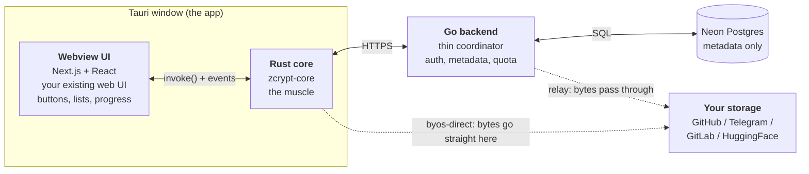
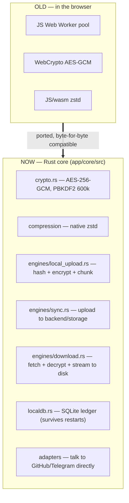
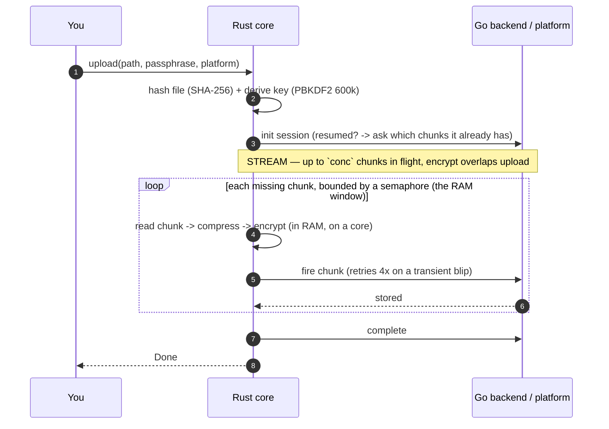
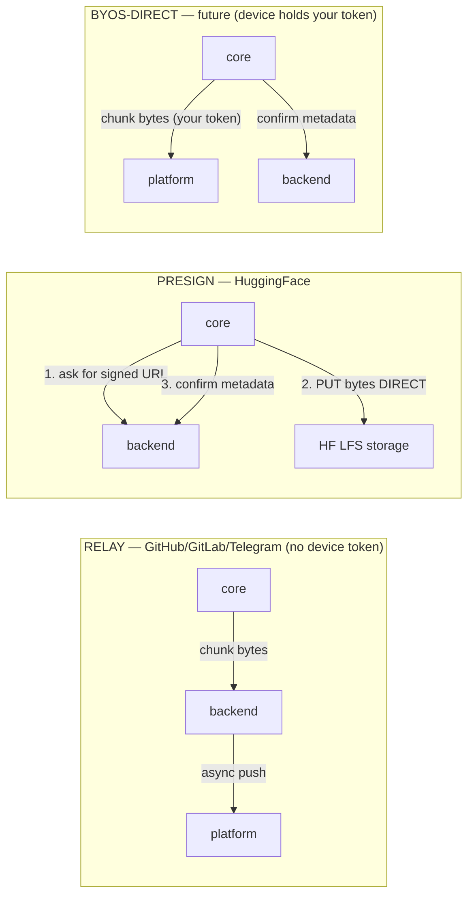
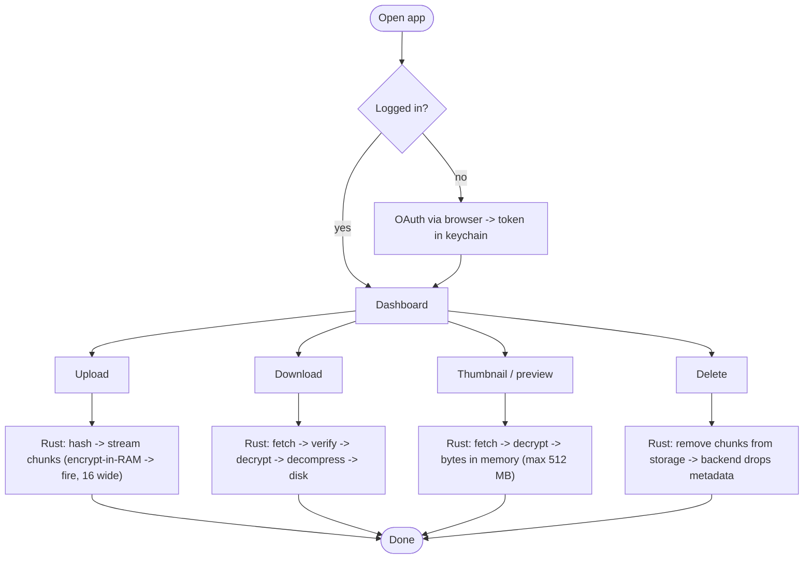

# zcrypt Desktop — Explain It Like I'm New (flows, Rust, and the fixes)

> A plain-English + visual tour: the three layers, every flow, exactly where
> Rust replaced the old browser pipeline, why an upload currently feels slow,
> and what each fix (P1–P5) changes. Open in VSCode/GitHub to see the diagrams.

---

## 1. The three layers — who does what

The desktop app is **one window** but **three programs** talking to each other.



| Layer | Language | Job | Sees your file bytes? |
|-------|----------|-----|------------------------|
| **Webview UI** | TypeScript/React | What you *see* — buttons, file list, progress. Sends commands to the core. | No (no crypto here) |
| **Rust core** | Rust (`app/core`) | The *muscle*: hashing, compression, **AES-256 encryption**, chunking, the local DB, uploads, downloads, deletes. | Yes — encrypts/decrypts |
| **Go backend** | Go (`app/backend`) | The *coordinator*: who you are, which file owns which chunks + where, your quota. | Only in **relay** mode |
| **Your storage** | — | Where encrypted chunks physically live. | Only **encrypted** bytes |

**One sentence:** the UI is glass, the Rust core is the engine, the Go backend
is the traffic controller, your storage is the garage.

---

## 2. Where Rust is used (the replacement map)

Before: all heavy work ran in the **browser** (Web Workers + JS crypto). Now it
runs in **native Rust** — same algorithms, same file format, just compiled,
multi-core, no browser sandbox.



- **`crypto.rs`** — the encryption. Your passphrase → key (PBKDF2-SHA256, 600k
  rounds), then AES-256-GCM per chunk. *Byte-identical* to the old web + Go
  crypto, so a file encrypted on desktop still opens on the web app.
- **`compression/`** — zstd; keeps compression only if it saves ≥5%.
- **`engines/local_upload.rs`** — reads your file, hashes it, encrypts every
  chunk, writes them to a local staging folder + records them in the ledger.
- **`engines/sync.rs`** — pushes staged chunks to the backend (relay) or
  straight to your storage (byos-direct).
- **`engines/download.rs`** — reverse: fetch → verify → decrypt → decompress →
  stream to disk (streaming = a 3 GB file can't blow up RAM).
- **`localdb.rs`** — a small SQLite "ledger" on disk that remembers every
  file/chunk + its state, so an interrupted upload resumes after a restart.
- **`adapters/`** — code that speaks GitHub's / Telegram's API directly.

---

## 3. Upload — parallel concurrent chunk streaming (current)

`engines::upload` → [`stream_upload.rs`](../app/core/src/engines/stream_upload.rs).
Read a chunk → encrypt it IN MEMORY → fire it at the platform → free it, with N
chunks in flight at once. **No local-disk staging** — a 1.4 GB (or 100 GB) file
streams through a small bounded RAM window (`conc` chunks), never the whole file.



- **One phase, one bar** — encrypt and upload happen together, so the progress
  bar moves once (no more 0→100 twice).
- **Bounded RAM**: `conc = cores×2, clamped 4–16, capped so conc×chunk ≤ 256 MB`.
- **Resumable**: on retry the backend reports which chunks it already has; only
  the missing ones re-stream (browser model — no local ciphertext hoarding).
- **Per-chunk retry** (4× backoff): one dropped connection can't kill the whole
  multi-minute upload. Safe because the backend dedups by chunk index.

### Measured (1.4 GB, `android-studio-quail2-mac_arm copy.dmg`, relay, local dev)

| | Old (encrypt-all-then-upload) | Now (streaming) |
|---|---|---|
| **Total** | ~11 min | **3 min 3 s** (~3.6× faster) |
| Concurrency | 2–4 | **16** |
| Reliability | died mid-way, no retry | completed clean |

Breakdown of the 3 min: **hash + key derivation 77.7 s**, **chunk streaming
105.1 s**. The reported **14 MB/s is a local-loopback figure**, not true wire
speed — see §5. The 77.7 s hash phase (the old "stuck at 0% / deriving_key") is
the next fixable slice: 1.4 GB should hash in ~1–2 s, so ~18 MB/s says the read
is disk-bound or inefficient.

---

## 4. Why it was slow before (the two mistakes, now fixed)

The old `local_upload` + `sync` split (1) encrypted the **whole file to local
disk first**, then (2) read it all back to upload — **serial, with a disk
round-trip the browser never paid**:

```
   OLD:  [==== encrypt ALL to disk ====][==== read back + upload ALL ====]   ~11 min
   NOW:  read→encrypt→fire, overlapped, 16 wide, no disk                     ~3 min
```

(The local-first disk path still exists for the future offline / folder-watch
background backup — it's just not the foreground path anymore.)

---

## 5. The three delivery planes (and where the BYTES go)

`upload_one` in `stream_upload.rs` fires each chunk one of three ways. The only
difference that matters is **who carries the bytes**:



| Plane | Who carries bytes | Auth | Used by |
|---|---|---|---|
| **Relay** | core → **backend** → platform (backend pushes async) | backend's token | GitHub / GitLab / Telegram **today** (no device token) |
| **Presign** | core → **platform storage directly** | backend signs a one-time URL | **HuggingFace** (LFS) |
| **byos-direct** | core → **platform directly** | **your** token (OS keychain) | any platform, **future** |

### Per-platform detail

- **GitHub (what you tested) — relay.** `upload_chunk` PUTs the encrypted chunk
  to `/api/upload/{sid}/chunk/{idx}`; the backend stages it + records metadata,
  then a backend worker commits it to GitHub via the Contents API **async**.
  Bytes pass *through* the backend.
- **HuggingFace — presign (the different one).** Set by `direct_upload=true` on
  the init response. Per chunk: `presign_chunk` (backend returns an HF LFS
  upload URL + headers) → `direct_upload_to_url` (core PUTs the bytes **straight
  to HF's storage** — no bearer auth, the signed URL *is* the credential) →
  `confirm_chunk` (metadata only). **Bytes skip the backend entirely** — so HF
  is inherently lighter on the server than GitHub relay, even without a device
  token. This is the same presign→PUT→confirm flow the browser used; the
  streaming engine just runs it 16-wide now.
- **Telegram — relay today.** Backend sends each 10 MB chunk to a chat via the
  **Bot API** (`remote_path = msgID:fileID`). Bytes pass through the backend.
  **Future:** byos-direct via the user's bot token, and **MTProto** for very
  large files (Bot API caps at ~50 MB/file; MTProto allows ~2 GB/file, so bigger
  chunks + far fewer round-trips for huge uploads). Same streaming loop — only
  the adapter changes.

### Why relay "feels same speed" on your laptop

Your backend runs on `localhost`, so `core → localhost` is loopback (instant),
and the backend does the real platform push. That's why this run reported
**14 MB/s** — the *loopback* rate to the local backend, ~3.4× your real 33 Mbps
uplink. The true wire speed (bytes actually reaching GitHub) is still bound by
your uplink (~6 min for 1.4 GB), happening async on the backend. **In prod**
(remote backend) relay makes every byte cross the internet twice; **presign**
(HF) and **byos-direct** avoid that — the win shows there, not on localhost.

> byos-direct isn't active on this machine yet: connecting a platform from the
> **web** stores the token encrypted on the *server*; it's never pushed to this
> device. Connecting from **desktop Settings** writes it to the keychain and
> flips that platform to byos-direct. Auto-syncing the token to new devices is a
> separate roadmap item.

---

## 6. Fix status

- ✅ **P1 — parallel concurrent chunk streaming** (§3). Done: 11 min → 3 min,
  one bar, encrypt+upload overlapped, no disk detour. **+ per-chunk retry (4×)**
  and a `FAILED at N/141 — <error>` log line (the missing retry + invisible
  error were what killed the first attempt).
- ✅ **P2 (partial) — concurrency** now device-scaled (`cores×2`, 4–16,
  RAM-capped) and streamed. **Still open:** device-*tier* detection (chunk size
  is still the hardcoded `NORMAL` 10 MB; a strong Mac could use bigger chunks =
  fewer round-trips).
- ✅ **P3 — one progress bar.** Done: encrypt+upload are a single phase, blend
  maps the whole bar to one continuous 0→100.
- ⏳ **P4 — pause/resume + survive-reload.** Pause still hidden on desktop;
  streaming resume (backend reports uploaded chunks) covers retry/reload, but a
  real pause button is still to do.
- ⏳ **P5 — resource monitor.** Live RAM/CPU panel for app + backend. Not built;
  for now the engine prints a timing line (`total / upload / MB/s`) per upload.
- ⏳ **Next fixable slice:** the **77.7 s hash phase** (~18 MB/s read for 1.4 GB
  — should be seconds).

---

## 7. All flows at a glance



Everything that touches your files is the Rust core — running natively on all
your cores, outside the browser sandbox, while staying byte-compatible with the
web app so your files work everywhere. That's the whole point of the migration;
P1–P5 are about making the *upload path* live up to it.
